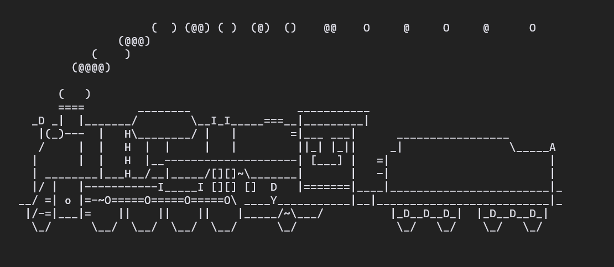

# SL: Cure your bad habit of mistyping

SL (Steam Locomotive) runs across your terminal when you type "sl" as
you meant to type "ls". It's just a joke command, and not useful at
all.

Copyright 1993,1998,2014 Toyoda Masashi (mtoyoda@acm.org)

[Original repository (C)](https://github.com/mtoyoda/sl)

## Name

sl - display animations aimed to correct users who accidentally enter **sl** instead of **ls**.

## Synopsis

**sl** \[ **-acFGlr** \]

## Description

**sl** is a highly advanced animation program for curing your bad habit of
mistyping. SL stands for Steam Locomotive.

## Options

| Flag   | Description                                                                            |
| ------ | -------------------------------------------------------------------------------------- |
| **-a** | An accident is occurring. People cry for help.                                         |
| **-c** | Different SL. C51 appears instead of D51.                                              |
| **-F** | It flies.                                                                              |
| **-G** | Different SL. Yellow TGV appears rather than D51.                                      |
| **-l** | Little version. The more 'l's you add, the more passenger cars are added to the train. |
| **-r** | Make the train red. Can be combined with any other options                             |

## See Also

**ls**

## Bugs

It sometimes lists directory contents.
